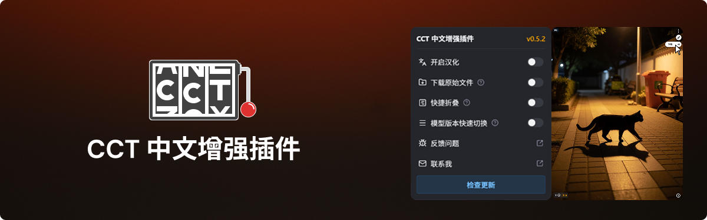
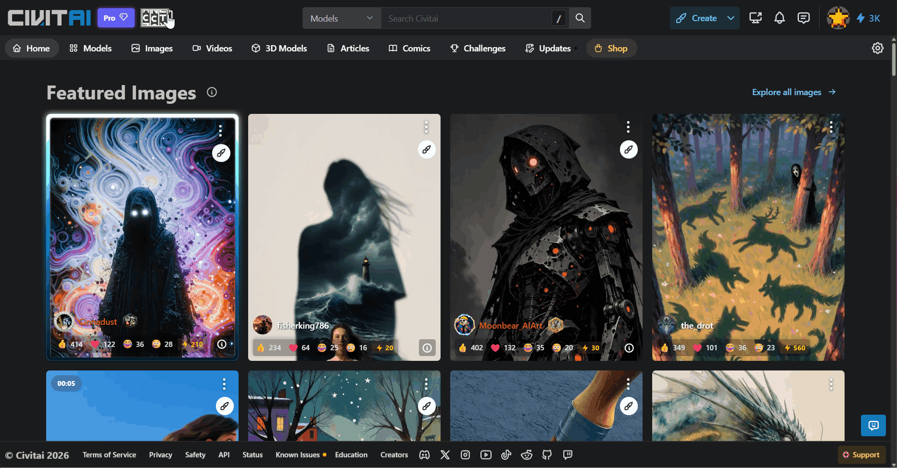
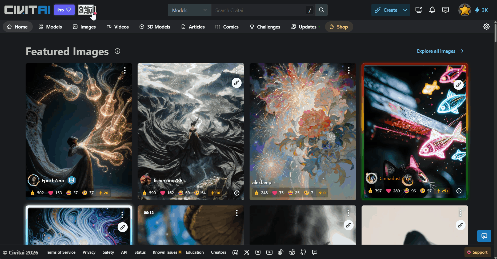
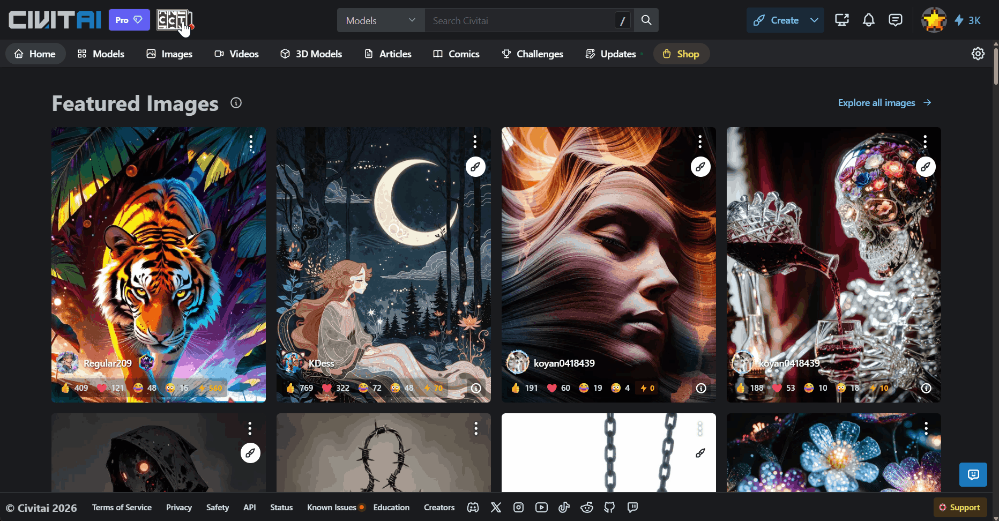
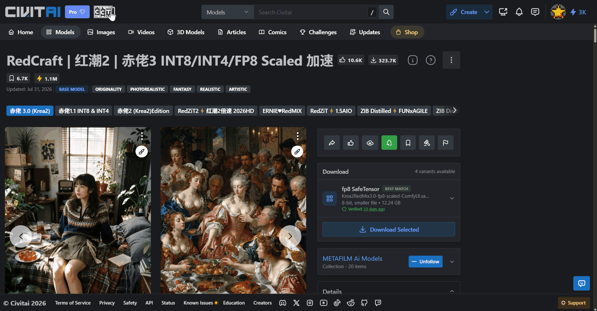
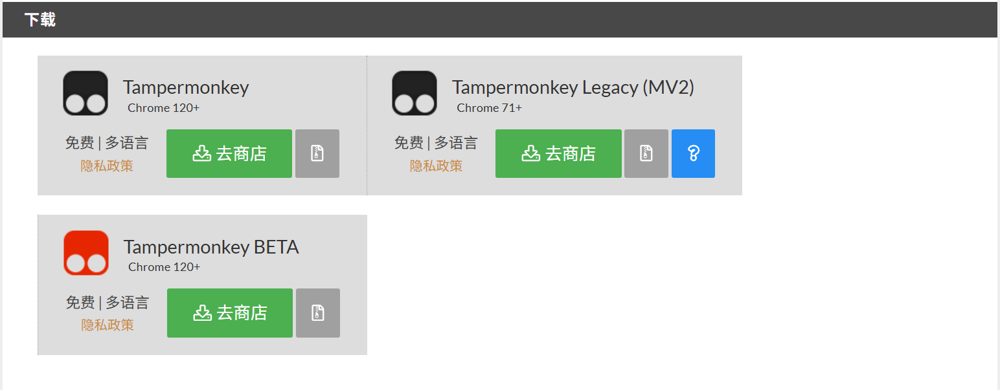
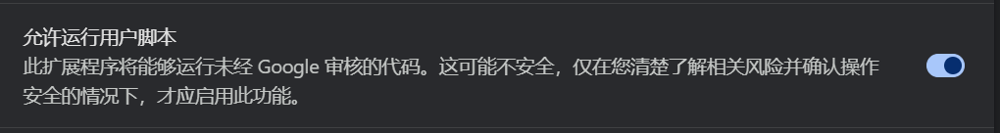

<h1 align="center">CCT 中文增强插件</h1>

  
  
  

 

  <strong>Civitai.com 与 Civitai.red 的汉化（中文化、本地化、翻译）及多项实用增强功能</strong> 

如：原始图片与视频快捷下载、模型介绍快速展开与折叠、模型版本快速查看与切换等。 

  
  适用于：
  <a href="https://www.microsoft.com/edge/download" target="_blank">Microsoft Edge</a>、
  <a href="https://www.google.com/chrome/" target="_blank">Google Chrome</a>、
  <a href="https://www.mozilla.org/firefox/new/" target="_blank">Mozilla Firefox</a>、
  <a href="https://www.apple.com/safari/" target="_blank">Apple Safari</a>
  和
  <a href="https://www.opera.com/download" target="_blank">Opera</a>
  浏览器

 

  
  
  
  
  
  

  <h3>
    <a href="https://github.com/strangechiao/Civitai-Chinese-Translator#CCT-中文增强插件">
      仓库首页
    </a>
    <!--  | 
    <a href="https://github.com/strangechiao/Civitai-Chinese-Translator#截图">
      截图
    </a> -->
     | 
    <a href="https://github.com/strangechiao/Civitai-Chinese-Translator#功能">
      功能介绍
    </a>
     | 
    <a href="https://github.com/strangechiao/Civitai-Chinese-Translator#下载与安装">
      下载与安装
    </a>
     | 
    <a href="https://github.com/strangechiao/Civitai-Chinese-Translator#进度">
      进度
    </a>
  </h3>

  支持语言：
  <a href="/README.md">
    简体中文
  </a>
  |
  繁体中文（计划中）

 

<h2 align="center">功能介绍</h2>

<h4>🌟CCT 功能菜单</h4>

通过统一的功能菜单管理 CCT，各项增强功能均可独立开启或关闭，并提供检查更新、反馈问题等快捷入口。

<h4>🌟Civitai / Civitai.red 页面汉化</h4>

自动将 Civitai.com 与 Civitai.red 的界面文本翻译为简体中文，包括导航栏、按钮、菜单、提示信息等内容；模型名称、模型类型及其他专有名词保持原文。

<h4>🌟原始文件快捷下载</h4>

  开启后，图片和视频卡片上会显示下载按钮。无需进入内容详情页，即可直接下载原始图片或视频文件，避免保存到经过压缩的预览文件。此功能默认关闭，可在 CCT 功能菜单中开启。

<h4>🌟模型介绍快速折叠</h4>

  当模型介绍和版本更新日志过长时，可通过页面右下角的快捷按钮随时展开或折叠介绍内容，无需反复滚动到原始按钮所在的位置。

<h4>🌟模型版本快速切换</h4>

  将模型原有的版本选项卡整理为侧边栏下拉菜单，减少大量版本占用的页面空间，方便快速查看并切换不同模型版本。

<h2 align="center">下载与安装</h2>

1. 安装浏览器扩展（以 Chrome 为例）：
   - 前往 [Tampermonkey 官网](https://www.tampermonkey.net/) 下载扩展。

   - 进入首页后现在页面的上面找到浏览器选项卡，选择你使用的浏览器。
     

   - 在页面下方找到下载，点“去商店”后进入对应的浏览器商店安装 Tampermonkey 扩展。
     

2. 配置浏览器
   - Chromium 内核的浏览器需要打开“**允许运行用户脚本**”（如Chrome、Edge等）[查看教程](https://www.tampermonkey.net/faq.php?q=Q209#Q209)。
     

3. 安装脚本
   - 点击 [CCT 中文增强插件](https://raw.githubusercontent.com/strangechiao/Civitai-Chinese-Translator/main/civitai-chinese-translator.user.js) 安装用户脚本，同时支持 Civitai.com 与 Civitai.red。

   - 安装后点击 Tampermonkey 图标，在下拉菜单中确认 CCT 中文增强插件已开启（正常情况下默认开启）。
   - 打开 Civitai 刷新网页或重启浏览器后，即可看到中文界面了。

   

<h2 align="center">进度</h2>

  持续更新，逐步完善中…

